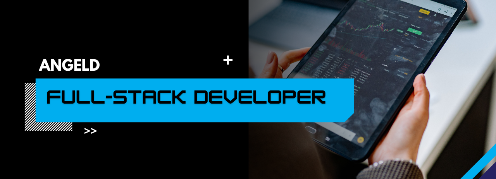

# 🚀 Ángel Parra 

<h4>¡Hola! Soy Ángel Parra, un desarrollador Full Stack con pasión por crear aplicaciones robustas, escalables y optimizadas. 
 Me especializo en el desarrollo frontend y backend, siempre buscando la mejor experiencia para los usuarios y una arquitectura eficiente en el backend.</h4>

### 💡 ¿Qué me define?

- Código limpio, optimizado y mantenible.
- Desarrollo de interfaces intuitivas y dinámicas.
- APIs eficientes y arquitecturas escalables.
- Aprendizaje continuo y adaptación a nuevas tecnologías.

  ### 🛠️ Tecnologías que uso:

📌 En mi perfil encontrarás proyectos personales, contribuciones open source y experimentos con nuevas tecnologías.